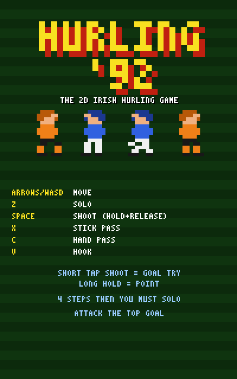
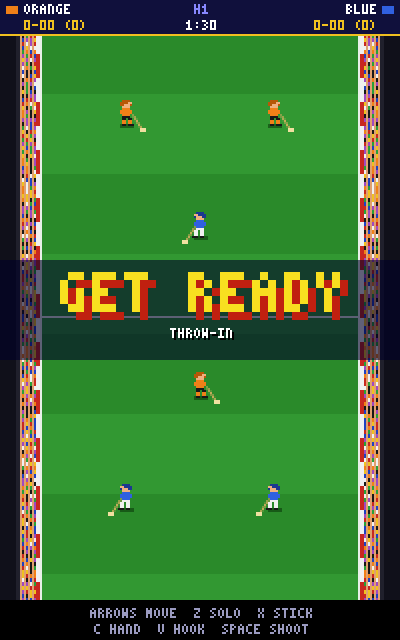
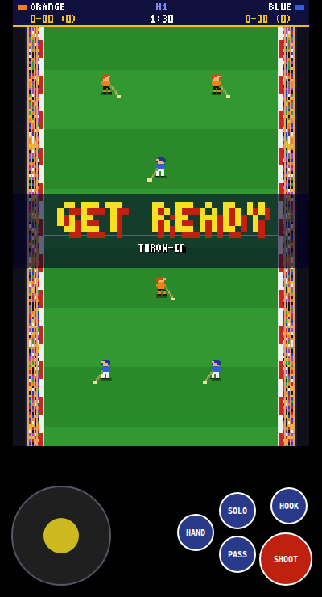

# Hurling '92

A 2D Irish hurling game in the style of early-90s sports games (200x320 low-res
portrait canvas, limited palette, chunky pixel sprites, chip-style sound). Runs in any
modern browser, no build step and no dependencies.

Sprites are pixel maps defined as text in `game.js` (`BODY` / `LEGS`) and
rendered to offscreen canvases at start-up, so there are no image assets.

## Play

Open `index.html` in a browser (or serve the folder, e.g. `python3 -m http.server`).
Add `?demo=1` to the URL to watch two AI teams play.

The pitch runs up and down the screen, which suits phones. You are **Orange** and attack the **top** goal. 7-a-side, two 90-second halves.
A goal (under the bar) is worth 3, a point (over the bar, between the posts) 1.

## Controls

| Key | Action |
| --- | --- |
| Arrows / WASD | Move (up = towards the goal you attack) (the player nearest the ball is selected automatically) |
| Z | **Solo** – run with the ball; you may take only 4 steps before you must solo (hold Z to keep soloing) |
| Space (hold & release) | **Shoot** – tap for a low goal attempt, hold longer for a lifted point |
| X | **Stick pass** – fast ground pass to a teammate in your facing direction |
| C | **Hand pass** – short lobbed pass |
| V (or Space without the ball) | **Hook** – swing at a nearby opponent to knock the ball loose, or clear a loose ball |
| Enter | Start / restart |

On phones and tablets on-screen controls appear automatically (joystick plus SOLO / PASS / HAND / HOOK / SHOOT buttons; tap the screen to start). Add `?touch` to the URL to force them on a desktop.

Ball out over the sideline, wide shots, 65s, puck-outs and the four-step rule are all handled.

## Screenshots

